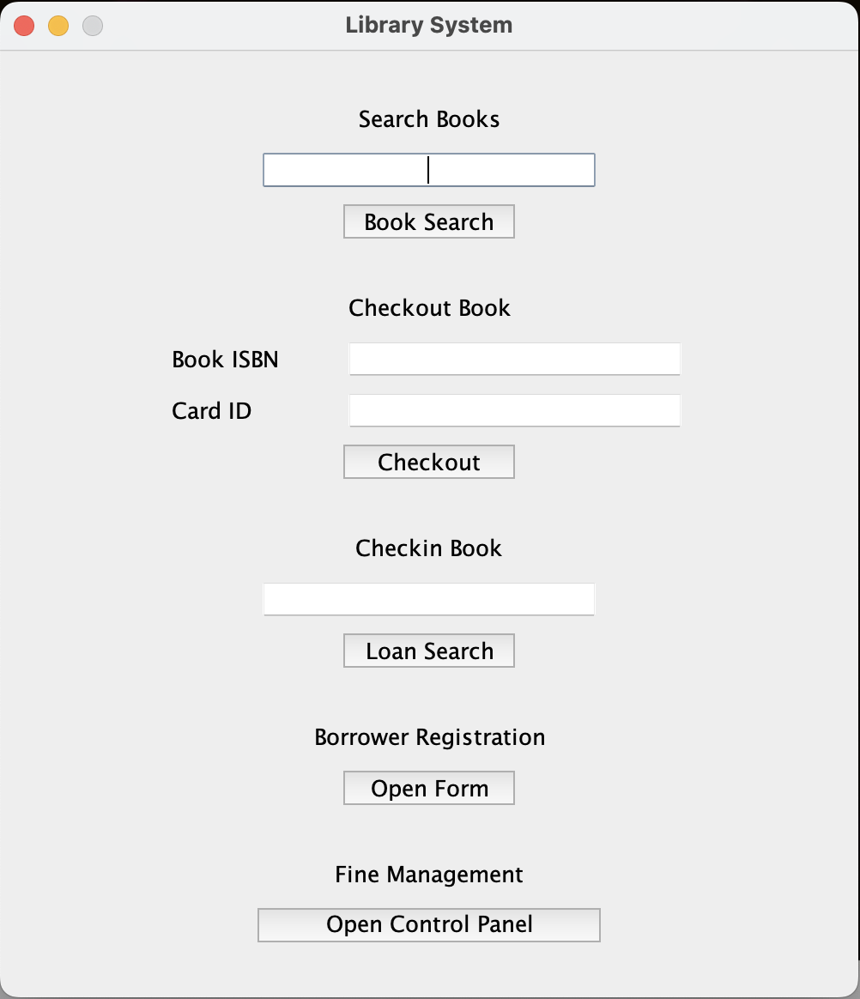
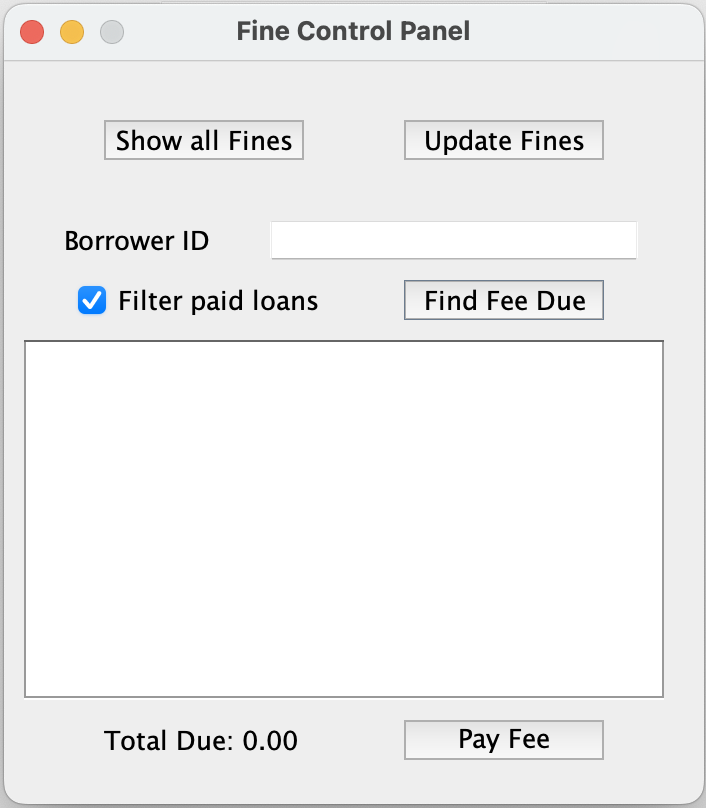
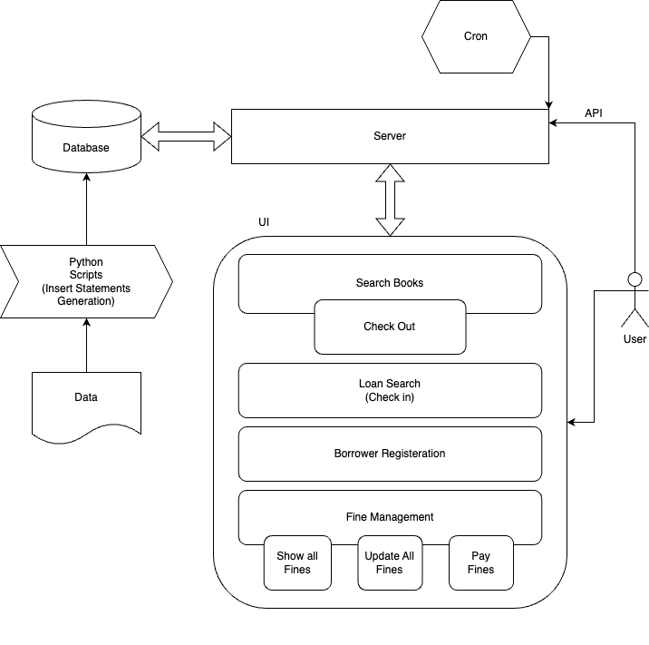
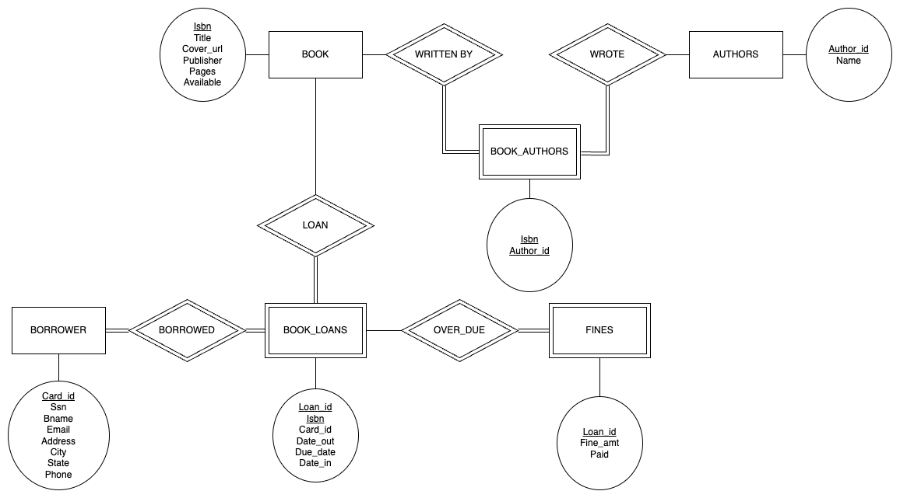

# Library System Programming Project

## Quickstart Guide
### Required Dependencies
* Docker
* Maven
* Java 8 or higher (OpenJDK)
* Any IDE (To run the main method)
* Python3

### How to launch (Mac)
1. Unzip the code.
2. Make sure that you have docker installed. [Download](https://www.docker.com/products/personal/)
3. Open the unzipped folder on terminal and run `docker compose up -d`.
4. To insert the data.
    1. Run `python3 Data/generate_insert_query.py`.
    2. Find the container name from `docker ps`
    3. Exec ino the docker container using `docker exec -it <container_name> bash`
    4. Run `mysql` (this is how you can access MySQL through CLI)
    5. Run `souce /app_data/Data/source_file.sql`
5. Using any IDE, run the main method in the `LibrarySystemApplication.java` class in src/main/java/com/librarysystem.

## Using the UI
As the application starts, you will be greeted with this screen:

- Search Books: Text field to search for books with part of title, part of author name, or part of ISBN.
- Checkout Book: Checkout books with exact ISBN.
- Checkin Book: Search for book loans with part of borrower's name, borrower's ID, or book ISBN.
- Borrower Registration: Open the borrower registration form.
- Fine Management: Open fine management control panel.

### Fine Management

There are two buttons to show update the fines, as well as show all the fines of all the borrowers. 
For every borrower, total fee due is shown at the bottom left with the table showing each of over due loans. 
Paid fines can be filtered out with checking the "Filter paid loans" checkbox.

## System Architecture
### Components
1. UI - Java Swing (Spring Component)
2. Server - Springboot Java Application
3. Database - MySQL docker container

The server also exposes REST APIs to *add a book* (single and batch), *update fines* (for the cron job).

### High level diagram

### Database
The MySQL database is hosted as a docker container. This allows easier hosting of the service on remote machines or cloud.

The initial data is imported using `INSERT` statements which are generated through a python script. The [compose file](compose.yaml) file allows for sourcing the data as the docker container is initialised. The source file also includes scheme creation commands as well.

The csv files are read line-by-line by a python script which further writes SQL statements to insert books, authors, book and author mapping, and borrowers. The mapping is maintained in a dictionary as the lines are read. We use the `codecs` python package to read non-latin characters in book titles and author names. The same is done for each of the tables using `DEFAULT CHARSET=utf8mb4`.

Since the database is hosted on the docker network, the 3306 port is exposed as specified in the `compose.yml` file. This also includes other DB and container configurations. All of the code is mounted as a volume so that the container has access to the source files.

### Application Server
The application is written using the Spring framework. Spring handles the JDBC connections whenever database configurations are provided in the `application.properties` file.

All of the annotated classes are instantiated as *beans*. This includes the GUI, entity models, and database interfaces. `LibraryResource` class exposes APIs to add books and update fines.

### UI
For the most part, this is an event based service. Java swing is able to make method calls directly through listeners.

Each window is a frame which can be interacted with independently. A frame is created by simply creating a `JFrame` object. Components for text inputs, button, and label are also added to the frame.

## Schema Diagram

## Challenges and Resolutions
### 1. Populating the database
Initial idea was to populate the data using curl command. The server exposes two API for the same, `addBook` and `addBooks`.

Although, functionally, the APIs work, this solution was not scalable for a service running on a single machine with database with no sharding. (no room for concurrent writes).

> 👍 **Solution**
> 
> It was much easier to have the python script generate the `INSERT` commands and pass it to the database as a source file. These queries can be further optimised by adding multiple rows in a single `INSERT` query.
>
> Docker also provides the functionality to run a source file on startup. (commented out, see [compose file](compose.yaml))

### 2. Layouts in Java Swing
Java Swing's `LayoutManager` automatically positions all the components within the window (frame) or a container. While it is helpful most of the times, it becomes difficult if you want to position and resize certain elements.

> 👍 **Solution**
>
> This was solved by not using the `LayoutManager` at all. The UI elements are placed are _absolute_ in terms of position and size. This takes away the capability to resize the window and shift around the components to fit on the screen.

### 3. Many-to-Many Relationship
The many-to-many relationships are mapped using a mapping table. Particular to this project, `BOOK_AUTHORS` maintains a mapping of the books and the authors who wrote it. While it seems trivial, the mapping table entity is not explicitly defined.

> 👍 **Solution**
> 
> A `@JoinTable` annotation is used which tells Spring JPA which table to use as the mapping table.

### 4. Fetching and Cascading
Since these entities are related, all of the "related" data is fetched based on a few strategies. This also applies to when you want to save or update the data.

> 👍 **Solution**
>
> To keep things simple, the related data is fetched "eagerly" (queries on related tables are run) and the cascade is "merged" (makes the updates easier without worrying about multiple entity instances).
>
> Further, each of the save and update methods in the [DatabaseService](src/main/java/com/librarysystem/services/DatabaseService.java) are annotated as `@Transactional`, which means that all the queries, updates and inserts related to one function of the application are done in a single transaction with the database.