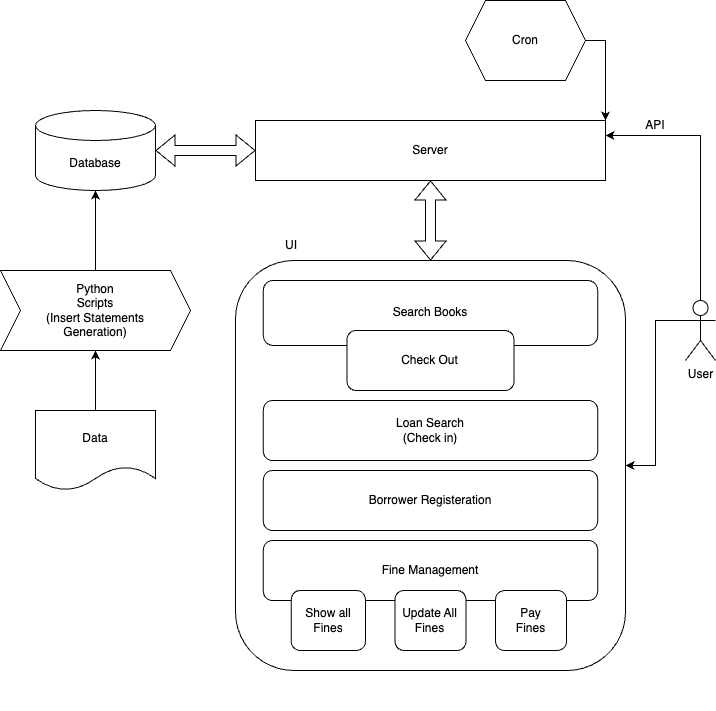
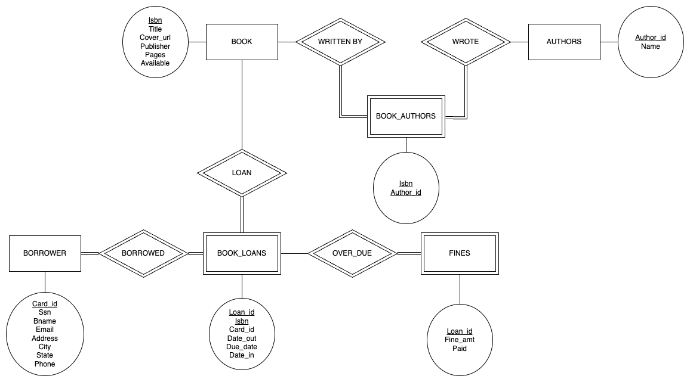

# Library System Programming Project
## System Architecture
### Components
1. UI - Java Swing (Spring Component)
2. Server - Springboot Java Application
3. Database - MySQL docker container

The server also exposes REST APIs to *add a book* (single and batch), *update fines* (for the cron job).

### High level diagram

### Database
The MySQL database is hosted as a docker container. This allows easier hosting of the service remote machines or cloud.

The initial data is imported using `INSERT` statements which are generated through a python script. The docker compose file allows for sourcing the data as the docker container is initialised. The source file also includes scheme creation commands as well.

The csv files are read line-by-line by a python script which further writes SQL statements to insert books, authors, book and author mapping, and borrowers. The mapping is maintained in a dictionary as the lines are read. We use the `codecs` python package to read non-latin characters in book titles and author names. The same is done for each of the tables using `DEFAULT CHARSET=utf8mb4`.

Since the database is hosted on the docker network, the 3306 port is exposed as specified in the `compose.yml` file. This also includes other DB and container configurations. All of the code is mounted as a volume so that the container has access to the source files.

### Application Server
The application is written using the Spring framework. Without much code, Spring handles the JDBC connections if database configurations are provided in the `application.properties` file.

All of the annotated classes are instantiated as *beans*. This includes the GUI, entity models, and database interfaces. `LibraryResource` class exposes APIs to add books and update fines.

### UI
For the most part, this is an event based service. Java swing is able to make method calls directly through listeners.

Each window is a frame which can be interacted with independently. A frame is created by simply creating a `JFrame` object. Components for text inputs, button, and label are also added to the frame.

## Schema Diagram

## Quickstart Guide
### Required Dependencies
* Docker
* Maven
* Java 8 or higher (OpenJDK)
* Any IDE (To run the main method)
* Python3

### How to launch (Mac)
1. Unzip the code.
2. Make sure that you have docker installed. [Download](https://www.docker.com/products/personal/)
3. Open the unzipped folder on terminal and run `docker compose up -d`.
4. To insert the data.
    1. Run `python3 Data/generate_insert_query.py`.
    2. Find the container name from `docker ps`
    3. Exec ino the docker container using `docker exec -it <container_name> bash`
    4. Run `mysql`
    5. Run `souce /app_data/Data/source_file.sql`
5. Using any IDE, run the main method in the `LibrarySystemApplication.java` class in src/main/java/com/librarysystem.